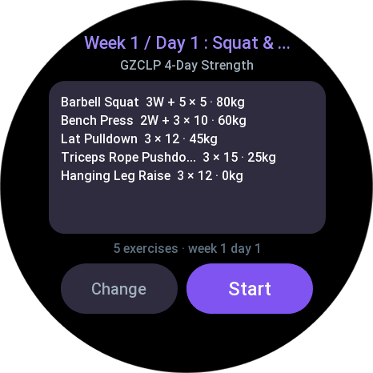
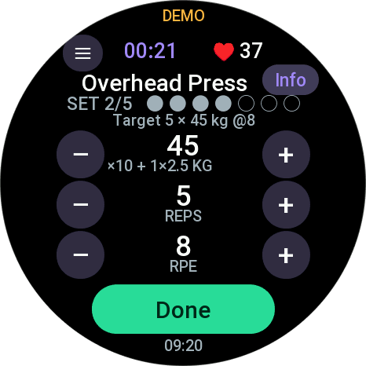
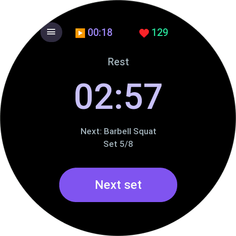
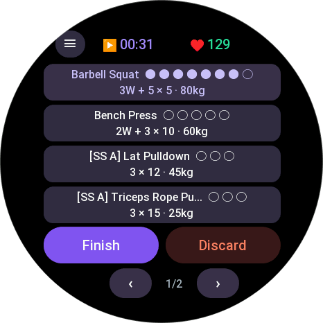
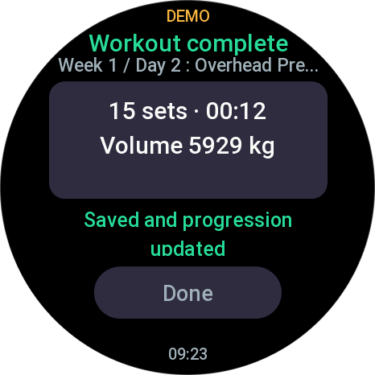

# Lifto for Zepp OS

Standalone app and Workout Extension for [Liftosaur](https://www.liftosaur.com) on compatible round and square Amazfit smartwatches running Zepp OS.


<p align="center">
  
  
  
  
  
</p>

## Lifto Companion

The standalone app provides the least constrained watch experience: program browsing, direct Cloud workouts, recovery tools, gestures, live heart rate, and the existing temporary preview QR workflow.

## Lifto Workout

The separate Workout Extension runs inside Zepp Strength Training. It keeps the native Zepp activity and metrics visible while the shared Lifto controller handles prescriptions, set logging, rest, recovery, and Liftosaur finalization through click-only screens.

The two apps are complementary and can be installed together. Liftosaur Cloud is their shared workout handoff; credentials remain inside each app's phone Side Service.

Workout Extension documentation:

- [Manual Setup Actions](docs/workout-extension-manual-actions.md)
- [Hardware Test Plan](docs/workout-extension-hardware-test-plan.md)

---

## Try it now (test build)

<p align="center">
  
</p>

> ## ⚠️ Read this before scanning
>
> ### This QR code expires on 2026-09-08 at 15:10 UTC
>
> That is 17:10 Central European Summer Time. After that moment it stops
> working and returns a download error.
>
> The deadline is not my choice: `zeus preview` uploads the build to Zepp's own
> servers, and Zepp keeps a preview for **7 days** before deleting it. There is
> no way to extend it. This README gets a fresh code when the current one
> lapses, so come back to this page rather than reusing an old screenshot.
>
> ### Supported models
>
> This single QR code covers all 28 round and square models running Zepp OS 3.6+:
>
> - **Round**: Active 2 (Round), Active 2 NFC (Round), Active 3 Premium, Active Edge, Active Max, Balance, Balance 2, Balance 2 XT, Balance 3, Balance 3 Ti, Balance Ultra, Cheetah (Round), Cheetah 2 Pro, Cheetah 2 Ultra, Cheetah Pro, Cheetah Pro Kelvin Kiptum, Falcon, T-Rex 3, T-Rex 3 Pro (44mm), T-Rex 3 Pro (48mm), T-Rex Ultra, T-Rex Ultra 2.
> - **Square**: Active, Active 2 (Square), Active 2 NFC (Square), Bip 6, Bip Max, Cheetah (Square).
>
> Watches that are too old for the Zepp OS API level this project targets
> will refuse to install whatever you scan. That is not a bug, so please do not
> report it as one.

**Version:** Lifto Companion 0.4.0 beta. The temporary QR below installs the previously published 0.3.3 build.

Developer Mode must be enabled in the Zepp app. Demo mode needs no Liftosaur
account. Cloud synchronization requires a Liftosaur account with at least one
program. Full walkthrough, phone only and no computer required:
**[docs/tester-guide.md](docs/tester-guide.md)**.

---

## The API decides, the watch asks

Liftosaur Cloud is the shared current-workout source of truth using the official Liftosaur
Running a Workout API. The watch runs no Liftoscript and filters no exercise by name.
`GET /workout/next` previews either your official upcoming workout or an explicit selection
(program, week, day); `POST /workout/start` creates the shared active session with the
watch's real start time; `POST /workout/sets` syncs completed sets with authoritative server
evaluation; and `POST /workout/finish` atomically records history, progression, 1RM updates,
and advances the official next-workout pointer.

A session started or modified on the watch or in the official Liftosaur phone app can be
continued on either device via `GET /workout/current`.

## Features

- **Direct Cloud sync**: Liftosaur Cloud is the shared source of truth for active workouts.
- **Official next workout & explicit selection**: preview the scheduled workout or pick an explicit program, week, and day via `GET /workout/next`.
- **Cross-device continuation**: continue active workouts started on the watch or the official phone app (`GET /workout/current`).
- **Full prescriptions**: warmup sets, calculated plate combinations, user rest defaults, weights, rep targets, and superset sequences come pre-resolved from Liftosaur Cloud without watch-side guessing.
- **Authoritative set logging**: `POST /workout/sets` drains queued sets in order; responses apply server update scripts immediately.
- **Atomic finalisation**: `POST /workout/finish` sends start time, end time, and pause intervals, atomically saving history, progression, and the official phone next-day pointer.
- **Repeat-safe synchronization**: set writes and workout finish are safe to repeat; duplicate requests return confirmed server state.
- **Live heart rate** via `@zos/sensor`, with zone colouring.
- **Rest timer & overtime**: absolute-time countdown with haptic vibration at zero and a negative overtime counter.
- **Display wake lock** during active workouts (`@zos/display`).
- **Crash-proof sessions**: the plan, journal, write queue, pause intervals, and finish intent are persisted locally. An interrupted app resumes on the exact active set.
- **Mobile settings & privacy**: your Liftosaur API key (`lftsk_...`) stays on the phone. Writes identify the client using a stable installation ID in phone settings storage and `X-Liftosaur-Client`.

---

## Architecture

```text
┌─────────────────────────────────────────────────────────┐
│                      Amazfit Watch                      │
│                                                         │
│  page/common/index.js      standalone workout UI        │
│       │                                                 │
│  shared/workout-controller.js                           │
│       │                    sync, queues & recovery      │
│       ▼                                                 │
│  shared/workout-session.js pure state machine + journal │
│       │                                                 │
│  shared/session-storage.js local storage persistence    │
│       │                                                 │
│  data-widget/common/       workout extension UI         │
└───────────────────────────┬─────────────────────────────┘
                            │ BLE / ZML protocol v3
┌───────────────────────────▼─────────────────────────────┐
│                    Mobile Side Service                  │
│                                                         │
│  app-side/router.js             message dispatch (v3)   │
│  app-side/workout-service.js    running workout adapter │
│  app-side/liftosaur-api-client.js  the only HTTP client │
│  setting/index.js               API key entry           │
└───────────────────────────┬─────────────────────────────┘
                            │ HTTPS / REST
┌───────────────────────────▼─────────────────────────────┐
│                    Liftosaur Cloud                      │
│  Running a Workout API (/workout/*)   source of truth   │
└─────────────────────────────────────────────────────────┘
```

Shared, platform-independent modules:

| Module | Responsibility |
| --- | --- |
| `shared/workout-controller.js` | Own local workout state, persistence, Cloud synchronization, polling, conflicts, finish, and discard |
| `shared/workout-api-plan.js` | Map official `data.workout` objects into the local day plan |
| `shared/workout-session.js` | The session state machine, set journal, and pause intervals |
| `shared/workout-refresh-policy.js` | Coalesced action refreshes, passive timing, and failure backoff |
| `shared/weight-rounding.js` | Loadable-weight plate math and weight string parsing |
| `shared/rest-alert.js` | Rest alert state tracking, foreground zero-crossing, and resume expiry |
| `shared/workout-extension-nav.js` | Extension screen names and formatting helpers |
| `shared/workout-extension-metrics.js` | Defensive native duration and calorie response parsing |
| `shared/protocol.js` | The device <-> phone Protocol v3 envelope |
| `shared/liftohistory.js` | Parse and format Liftohistory text (legacy & diagnostics) |
| `shared/liftoscript-outline.js` | Read `#` week and `##` day headers (catalog fallback) |

### Known limits & notes

- **Timed sets & prompted variables**: sets with a prescribed timer countdown or arbitrary prompted script variables currently ask the user to complete that set in the official Liftosaur phone app. The watch polls and adopts the completed result.
- **Native workout activity**: direct sync does not create a Zepp native workout activity. Native workout integration remains separately gated by real-device testing.
- **Workout Extension rest alerts**: vibration is unit-tested while Lifto has focus. Zepp pauses the extension when it loses focus, so an expired rest alerts once when Lifto resumes; background delivery remains unconfirmed.
- **Legacy REST flow**: the older Playground replay and raw `/history` + `/programs` write flow remains only for one-time recovery of version 1 local snapshots. In that legacy flow, the official phone app day pointer does not advance. Under the Running a Workout API, the phone pointer advances automatically on finish.

---

## Development & Testing

### Requirements
- Node.js 20+
- [Zeus CLI](https://docs.zepp.com/docs/guides/tools/zeus-cli/) `npm install -g @zeppos/zeus-cli`

### Running Unit Tests
```bash
npm test
```

### Building Packages
```bash
# Build standalone Companion package
npm run build:companion

# Build Strength Training Workout Extension package (requires numeric App ID)
ZEPP_WORKOUT_EXTENSION_APP_ID=<app-id> npm run build:workout

# Build both targets
ZEPP_WORKOUT_EXTENSION_APP_ID=<app-id> npm run build:all
```

### Running on Simulator or Generating Previews
```powershell
# Preview on emulator
.\dev.ps1

# Generate Lifto Companion preview QR (root project)
npm run preview:companion

# Generate Lifto Workout preview QR (requires real dedicated App ID)
ZEPP_WORKOUT_EXTENSION_APP_ID=<app-id> npm run preview:workout
```

Both `zeus preview` QR codes are hosted by Zepp and expire after about 7 days. The Companion QR keeps its 28-device bundle. The Workout command requests the same build matrix, but compatible hardware remains unclaimed until the physical-watch plan passes. Workout preview generation requires a real dedicated App ID registered in the Zepp Developer Console.

### CI Validation
Pull requests and pushes run automated validation via GitHub Actions using Node 24 LTS (`npm ci`, `npm test`, and synthetic Workout Extension generation). No credentials or store access are required.

### Installing as a Tester

If you were sent a QR code and just want to run the app on your watch, follow
[docs/tester-guide.md](docs/tester-guide.md). It needs a phone only, no computer.

---

## Changelog

Release history is in [CHANGELOG.md](CHANGELOG.md).

---

## Disclaimer

This project is an independent open-source client and is not affiliated with, maintained by, or endorsed by Anton Astashov ([@astashov](https://github.com/astashov)) or the official [Liftosaur](https://github.com/astashov/liftosaur) project. Liftosaur is a registered trademark of its respective owner.

---

## License

MIT

The application icon is original artwork created specifically for this project. It does not
reuse Liftosaur branding or assets and is distributed under the same MIT license.
